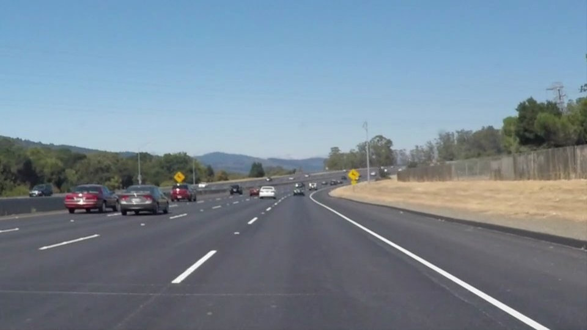

# Udacity Self-Driving Car Engineer Nanodegree


## Term 1 Project 1 : Finding Lane Lines on the Road
### Project Writeup

---
 
**Input** &nbsp;&nbsp;&nbsp;&nbsp;&nbsp;&nbsp;&nbsp;&nbsp;&nbsp;&nbsp; Images or Videos<br/>
**Output**  &nbsp;&nbsp;&nbsp;&nbsp;&nbsp;&nbsp;&nbsp;&nbsp;Images or Vidoes with two solid lines marking the left and right lanes on the road<br/>

---
The goal of this project are the following:
* Define various modular computer vision techniques and evaluate them on an input image
* Make a pipeline that finds lane lines on the road
* Reflect my work in a written report

This code can be applied to almost any types of road images/videos with a decent level of lane markings

---
### 1. Helper Functions
The following functions serve as modular code each implementing a different computer vision technique that will be later used for evaluating the lane markings on an image<br/>

##### **Color Conversion to Hue-Light-Saturation(HLS)**<br/>
It turns out that Canny Edge Detection works better if you start off with a HLS space image rather than in RGB Space(a regular color image). That's because the Yellow & White regions are highlighted in a much brighter form in HLS space rather than RGB space<br/>
*Images below show an RGB Image vs Image in HLS Space*

Original(RGB) Space | HLS Space
- | - 
 | 
---
##### **Color Conversion to Gray Scale**<br/>
Conversion to Gray scale helps greatly in computation. That's because a regular color image has 4 channels - R, G, B & Alpha. Whereas Grayscale has only 1 channel. This reduces the computational needs by a lot<br/>
*Images below show an RGB Image vs Image in Gray Scale*

Original(RGB) Space | Gray Space
- | - 
 | 
---
##### **Applying Gaussian Blur**<br/>
Applying Gaussian Blur makes the next process of Canny Detection much better as this removes any sudden spikes and introduces a normalization<br/>
*Images below show a Gray Scale Image vs its Gaussian counterpart*

Gray Space Image | Gaussian Blurred Image
- | - 
 | 
---
##### **Canny Edge Detection**<br/>
It turns out that edges are what drives the object(line in this case) detection, and Canny edges is one of the mainstream methodologies to do it. It isolates all the smooth stuff and highlights only the edges so that it is much easier to work<br/>
*Images below the Gaussian Smoothed Image and its Canny Transformation outcome*

Gaussian Blurred Image | Canny Edges
- | - 
 | 
---
##### **Region of Interest determination to evaluate only the region of interest**<br/>
We really want to consider only the lane before us, and isolate all the other stuff which is not of any importance for this specific problem. Hence we'll create a mask around our region of interest by identifying the vertices and filter the canny output with this mask so that the resulting image has canny edges only in the region of interest<br/>
*Images below shows how a Canny output is masked for Region of Interest*

Canny Edges | Canny Edges in Region of Interest
- | - 
 | 
---
##### **Hough Transformation**<br/>
Hough transformation transforms every point in the cartesian space to a line in Hough space. This helps to identify the weighted average and determine the best possible lines for our problem<br/>
*Images below show an Image with ROI applied and its Hough transformation that results in Hough lines*

Canny Edges in Region of Interest | Image with Hough Lines & Extrapolation
- | - 
 | 
---
##### **Averaging/Extrapolating Lines based on the outputs from Hough Transformation**<br/>
The result of Hough transformation are multiple lines per image. We need to find a way to come up with a single line representing these multiple lines. This can be done by average these lines along the mean slope of the lines. The length of this line can be arbitrarily set based on our requirement. This is done in the following way

* ###### Additional Explanation of the code for Averaging & Extrapolation
Hough Line Transformation returns a series of  lines. We can extract start and end co-ordinates in XY space for each line. We can use these co-ordinates to determine various attributes like mean, slope and intercept.<br/>
For each line in Hough space, determine the mean X, Y, and slope<br/>
If Slope is positive ==> it is right inclined meaning left lane. Similar logic for right lane
You can ignore the near horizontal lines as you would never have a path horizontal to your vehicle on the road<br/>
Once the mean X,Y & Slope are available, you can extrapolate the line by using the formula
Given a point `(x1,y1)` and slope m, <br/> ``(y-y1) = m(x-x1) ==> x = ((y-y1)/m) + x1``<br/>
So, determine point `(x, y)` randomly defining y - since this is an equation, any value of y will correspond to its equivalent x<br/>

*Images below show the final Input Image, Hough output, and Input Image with solid lane markers*

Original(RGB) Space | Image with Hough Lines & Extrapolation | Image with Lane Markers
- | - 
 |  | 

Once all the above methods are defined, the ask is just about using these functions in a proper way to get the resulting output.

---

### 2. Lane Finding Pipeline<br/>
The Lane Finding Pipeline uses various helper functions defined above in a particular sequence and evalues the required output
The Land Finding Pipeline consisted of the following steps

#### Image Processing
* Accepts an input image
* Converts the input to Hue-Light-Saturation Space
* Converts the output of HLS space to Gray Space
* Converts the Gray Space Image to Canny Edges
* Evaluates the Region of Interest based on the best possible assumption of the vertices and masks the Canny output
* Evaluates Hough lines from the Canny Edges in Region of Interest
* Averages the Hough lines and extrapolates the lines to form two single solid lines - one for each lane

#### Video Processing
A Video is a stream of images called frames. Hence processing a video is nothing but processing each individual frame in sequenece. This code snippet uses the *Image Processing* pipeline to process individual frames and renders it as a video.

Note : Both Image & Video are written to output directories


### 3. Potential Shortcomings<br/>
There could be some potential shortcomings with this code. Some of them could be
* This code assumes a decent level of lane marking on the roads. It might not be very helpful in situations where there are no proper lane markings
* The solid line is of the same width from start to end. As the distance goes far from the bottom of the image, the line can be reduced in width to align with the lane markings
* The length of the solid line is a constant here. The code could be further tuned to calculate the mean length of each set of lines in Hough space, and applying the dynamic length to the solid lines

### 4. Possible Improvements<br/>
There are some possible improvements I could think of
* The logic in averaging and extrapolating can be enhanced by using different advanced techniques so that the line is adaptive rather than a standard width & length line
* Some frames in the optional challenge video have gone crazy while calculating the lane lines. As mentioned above, fine tuning the draw_lane_lines function could avoid this
* Instead of straight lines, there should be a way of calculating curved lines, and highlighting the region instead of an image would give a much greater outlook to the project
* The code for Video processing assumes color video as we are using VideoFileClip.fl_image. I would have to explore a way to write with matplotlib or other utility so that it doens't assume anything

### 5. Confirming to Project Rubric<br/>
My project satisfies all the project rubric points.


---

### Installation & Setup Instructions
---

### **Technology Stack** :
  * Python 3.6.3
  * OpenCV for Computer Vision Processing
  * numpy for array/matrices handling
  * matplotlib for Image plotting
  * moviepy for image processing
  * Jupyter Notebook as IDE
  

### **Setting up the Environment** <br/>
* Install miniconda or any package Management utility like pip
* setup a conda environment with all required packages
* activate the environment
* clone [Git Repo](https://github.com/mymachinelearnings/CarND-LaneLines-P1.git) to your local computer and open the code in Jupyter Notebook
* Run & Enjoy!
    
**Note** : This is part of Udacity's Self Driving Car Nanodegree Project 1. clear setup instructions are present [here](https://github.com/udacity/CarND-Term1-Starter-Kit/blob/master/doc/configure_via_anaconda.md)


### **Project Files** <br/>
* README.md 
    * A brief overview of the project and setup
* Term1 Prj1 Finding Lanes.ipynb 
    * Jupyter Notebook with Python code to find lane lines
* writeup_T1P1 
    * Explanation of the code and others
* test_images, test_videos 
    * Test set for this project
* test_images_output, test_videos_output 
    * Resulting Image/Videos that are processed using the code
You can ignore the rest of the files

### **Running the code** <br/>
Once the environment is setup and the repository is cloned to your local machine, start Jupyter Notebook form the project folder using <br/> `jupyter notebook` command and run each cell `Shift + Enter` and the output will be inline & written to the output folders

Note : Test set for this code is contained in test_images & test_videos, and the resulting processed images & videos are present in test_images_output & test_video_output

---

### **Authors** <br/>
* Ravi Kiran Savirigana

### **Acknowledgements** <br/>
Thanks to Udacity for providing the startup code to start with. And a great community help from stackoverflow.com & github.com

```python

```